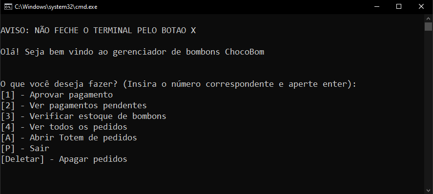
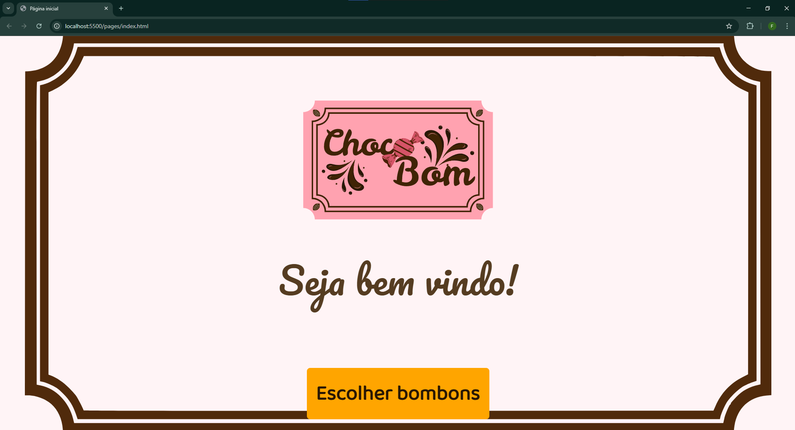
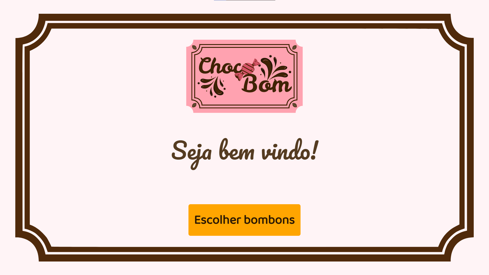

# Sistema de vendas de bombom 

Este é um projeto pessoal fullstack para realizar a venda de bombons através de um totem de autoatendimento rodando localmente, onde o usuário realiza seu pedido e se direciona para um funcionário efetuar o pagamento.

<div align=center>
    </img>
</div>

## Sumário

[Requisitos](#requisitos) \
[Como utilizar](#como-utilizar) \
[Como aprovar um pagamento](#como-aprovar-um-pagamento) \
[Como alterar a quantidade de bombons no estoque](#como-alterar-a-quantidade-de-bombons-no-estoque) \
[Interface do cliente](#interface-do-cliente)

## Requisitos
Os requisitos necessários para executar o sistema são:

### Python 3
- Para verificar se você tem o Python 3 instalado, execute este comando no CMD:

    ```cmd
    python --version
    ```
    Caso apareça a versão do Python após executar o programa, você já o tem instalado.


    Caso não tenha instalado, [clique aqui para instalar](https://python.org.br/instalacao-windows/).
    
### Flask
- Para instalar a biblioteca Flask, execute este código no CMD:
    ```cmd
    pip install flask
    ```
### Flask-CORS
- Para instalar a biblioteca Flask-CORS, execute este código no CMD:
    ```cmd
    pip install flask-cors
    ```

### Monitores
- 1 monitor touch para o usuário.
- 1 monitor comum para o funcionário (pode ser a tela do próprio notebook).

### Navegador
Os navegadores compatíveis com o sistema são: 
- Google Chrome - [clique aqui para instalar](https://www.google.com/intl/pt-BR/chrome/).
- Microsoft Edge - já instalado com o Windows.

## Como utilizar

1. Para iniciar o sistema, inicie o arquivo _iniciar_sistema.bat_ com um clique duplo, ou com _botão direito mouse_ --> _Abrir_.

<div align=center>
    
</div>

###

2. Ao iniciar o sistema, será aberto o terminal e inicializado os servidores locais do Front-End e Back-End. Logo após o sistema estará pronto para uso, estando aberto a interface do funcionário

<div align=center>
    
</div>

- OBS: Para mudar o tamanho da fonte, use o comando _CTRL + Scroll Mouse Up / Scroll Mouse Down_. 

###

3. Para acessar as funcionalidades do sistema, basta inserir o número / letra no índice antes da função (podendo ser tanto em minúsculo quanto em maiúsculo) e apertar a tecla [Enter]. Basta seguir as instruções no sistema para realizar a função corretamente.

<div align=center>
    
</div> 

###

4. Para abrir a interface do usuário, execute a função _[A] - Abrir Totem de pedidos_. A interface será aberta no navegador definido como padrão no Windows.

<div align=center>
    
</div>

- OBS: caso deseje utilizar outro navegador que não seja o padrão, basta copiar a url na aba de navegação e colar no outro navegador. Somente certifique-se que o navegador é compatível com o sistema.

###

5. Tendo o sistema aberto no navegador, mova-a para o monitor do totem e aperte a tecla _F11_ (ou a tecla equivalente) para deixar a página em tela cheia. Assim o sistema estará pronto para ser utilizado.

<div align=center>
    
</div>

- OBS: Caso, em tela cheia, estejam faltando elementos, ou então os elementos estejam desalinhados, tente ajustar o tamanho da página através do comando _CTRL + Scroll Mouse Up / Scroll Mouse Down_. Provavelmente o tamanho da tela é menor ou maior (como nos casos de laptops) e esse ajuste resolverá.

### Observações
- O servidor local é iniciado juntamente com o sistema, mas somente se encerra com a função _[P] - Sair_ do menu principal. Por isso, **não feche o terminal pelo botão "X"** após inicializar, pois isso vai fazer com que o servidor seja rodado localmente mesmo após encerrar o uso do terminal. 

- Se desejar fechar o sistema, sempre o encerre pela função _[P] - Sair_.

- Certifique-se de alterar a quantidade de bombons no estoque antes de iniciar as vendas.

## Como alterar a quantidade de bombons no estoque

1. Execute o comando __[3] - Verificar estoque de bombons__ no menu inicial.

###

2. Ao executar o comando __[3]__, aparecerá os seguintes comandos:
    - [1] - Adicionar bombom no estoque
    - [2] - Subtrair bombom do estoque
    - [3] - Tirar opção de bombom (remove o bombom do estoque)
    - [4] - Ver estoque
    - [9] - Voltar (volta ao menu principal)

<div align=center>
    
</div>

### Adicionar / subtrair bombom

1. Os comandos __[1]__ e __[2]__ funcionam do mesmo modo: o sistema irá mostrar o estoque e solicitar o nome exato do sabor de bombom que deseja ser modificado, e a quantidade do bombom a ser adicionada ou subtraída.

2. Após adicionar / subtrair o bombom, o sistema irá solicitar se deseja alterar o estoque de mais algum bombom. Caso a resposta seja negativa, o sistema volta ao menu do estoque.

<div align=center>
    
</div>

### Tirar opção de bombom

1. O comando __[3]__ remove a opção de bombom do estoque.

2. O sistema irá mostrar o estoque e solicitar o nome exato do sabor que deseja ser removido.

3. Ao fornecer o sabor, o sistema mostra a mensagem de sucesso e volta ao menu de estoque.

<div align=center>
    
</div>

## Como efetuar um pagamento

1. É possível visualizar os pedidos pendentes antes de aprová-los de duas maneiras: 
    - Com o comando __[1] - Aprovar pagamento__ (que irá mostrar os pedidos pendentes e dar a opção de efetuar o a pagamento).
    - Ou com o comando __[2] - Ver pagamentos pendentes__ (que só irá mostrá-los e retornar ao menu inicial) e depois com o comando __[1]__;

###

2. Após executar executar o comando __[1]__, será mostrado todos os pedidos pendentes de pagamento e 3 outros comandos:
    - _[A] - Atualizar_ (mostra se novos pedidos foram feitos)
    - _[C] - Aprovar pagamento_ (solicita o ID do pedido para efetuar o pagamento)
    - _[P] - Voltar_ (volta ao menu principal)

###

3. Executando o comando _[C]_, irá aparecer uma mensagem solicitando o ID do pedido sem os números "0" (por exemplo, se o ID do pedido é "Pedido#001", deve inserir somente o número "1"). \

###

4. Selecionando o pedido, aparecerá novamente o pedido selecionado juntamente com uma mensagem confirmando se deseja efetuar o pagamento. Sendo aprovado ou recusado, o sistema pergunta se deseja realizar outro pagamento. Caso o funcionário não queira, o sistema volta ao menu inicial.

###

<div align=center>
    
</div>

## Interface do cliente

- Tela inicial

<div align=center>
    
</div>

###

- Menu de sabores

<div align=center>
    
</div>

###

- Checkout

<div align=center>
    
</div>

###

- Inserir nome

<div align=center>
    
</div>

###

- Tela de sucesso

<div align=center>
    
</div>